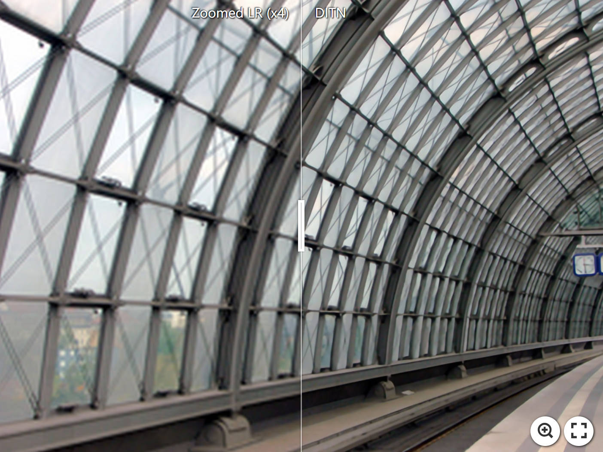
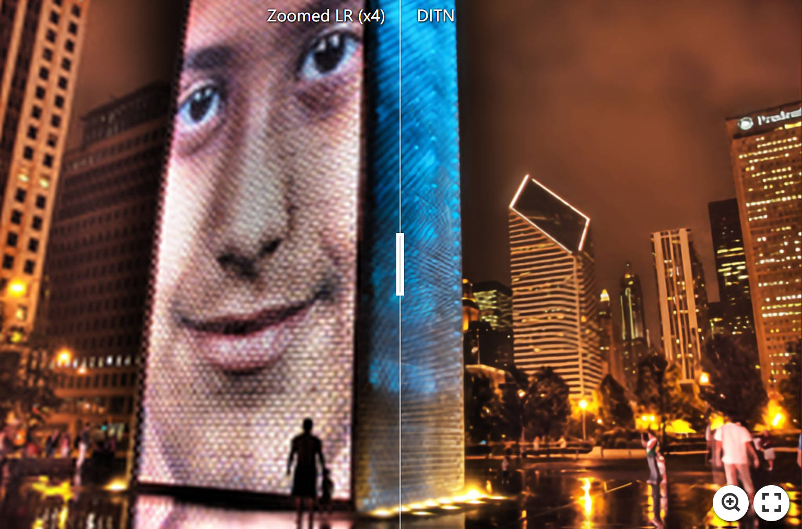
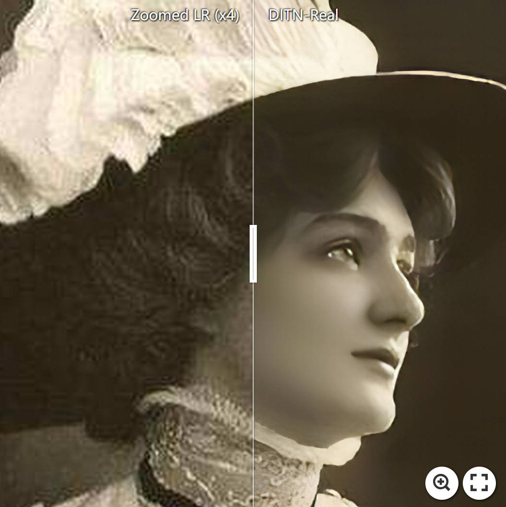
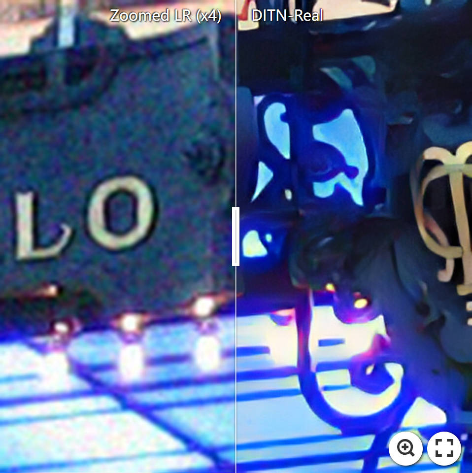
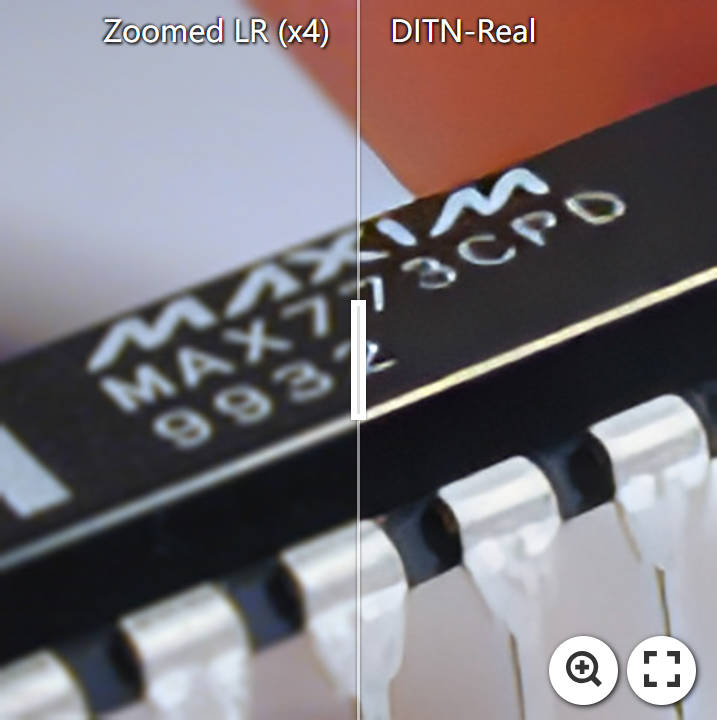
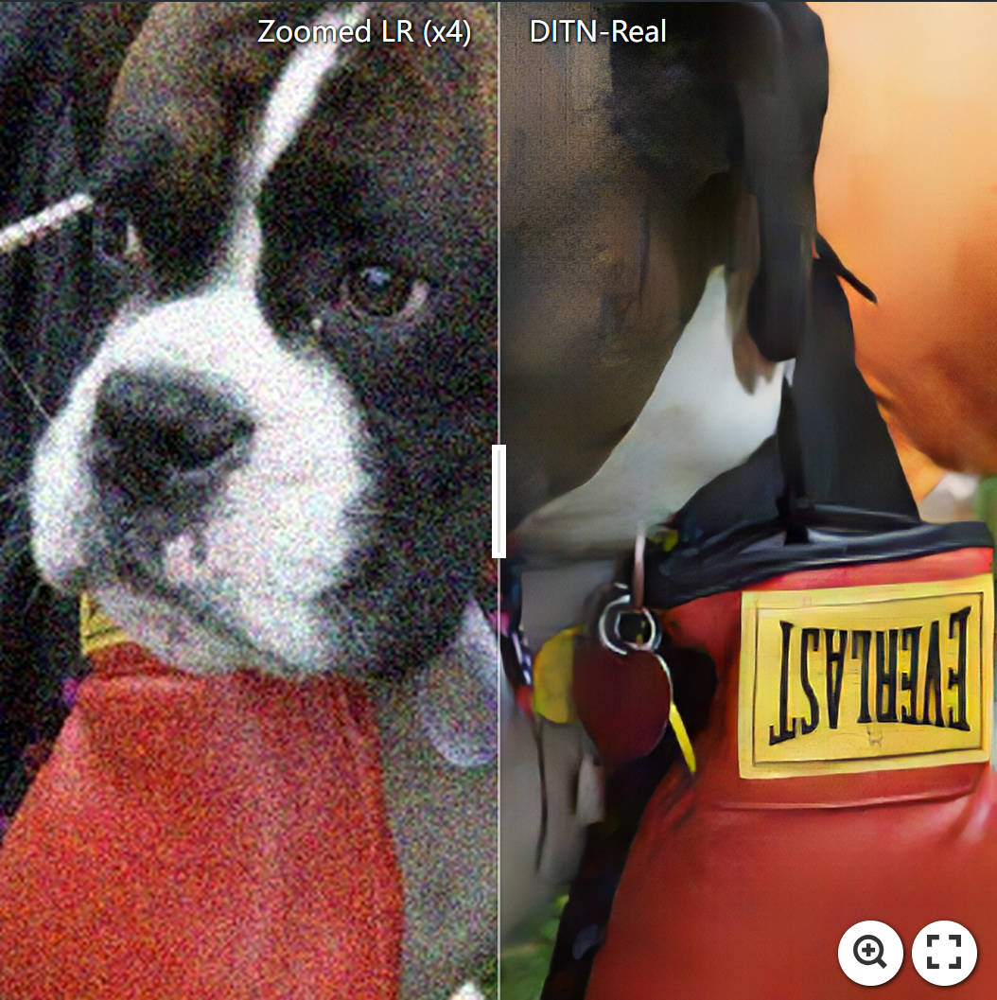

<p align="center">
  
</p>

# Unfolding Once is Enough: A Deployment-Friendly Transformer Unit for Super-Resolution
[Yong Liu](https://github.com/yongliuy), 
[Hang Dong](https://github.com/BookerDeWitt), 
Boyang Liang, 
Qingji Dong, 
Songwei Liu, 
Kai Chen, 
Fangmin Chen, 
Lean Fu, 
[Fei Wang](http://www.aiar.xjtu.edu.cn/info/1046/1242.htm)<br/>

[arXiv](https://github.com/yongliuy/DITN) | [BibTeX](#bibtex) 


:sparkling_heart: If DITN is helpful to your researches or projects, please help star this repository. Thanks! :hugs: 

 


>Recent years have witnessed a few attempts of vision transformers for single image super-resolution (SISR). 
Since the high resolution of intermediate features in SISR models increases memory and computational requirements, efficient SISR transformers are more favored. 
Based on some popular transformer backbone, many methods have explored reasonable schemes to reduce the computational complexity of the self-attention module while achieving impressive performance. 
However, these methods only focus on the performance on the training platform (e.g., Pytorch/Tensorflow) without further optimization for the deployment platform (e.g., TensorRT). 
Therefore, they inevitably contain some redundant operators, posing challenges for subsequent deployment in real-world applications. 
In this paper, we propose a deployment-friendly transformer unit, namely UFONE (i.e., UnFolding ONce is Enough), to alleviate these problems. 
In each UFONE, we introduce an Inner-patch Transformer Layer (ITL) to efficiently reconstruct the local structural information from patches and a Spatial-Aware Layer (SAL) to exploit the long-range dependencies between patches. 
Based on UFONE, we propose a Deployment-friendly Inner-patch Transformer Network (DITN) for the SISR task, which can achieve favorable performance with low latency and memory usage on both training and deployment platforms. 
Furthermore, to further boost the deployment efficiency of the proposed DITN on TensorRT, we also provide an efficient substitution for layer normalization and propose a fusion optimization strategy for specific operators. 
Extensive experiments show that our models can achieve competitive results in terms of qualitative and quantitative performance with high deployment efficiency.
<p align="center">

</p>


## Update
- **2023.07.06**: Create this repository.

## TODO
- [ ] New project website
- [ ] The training codes and scripts
- [ ] The deployment details
- [x] ~~Releasing pretrained models~~
- [x] ~~The inference codes and scripts~~


## Requirements
```
conda create -n ditn python=3.8
conda activate ditn
pip3 install -r requirements.txt
```

## Applications
### Demo on Base Evaluation Dataset
[](https://imgsli.com/MTk1NjE2) [](https://imgsli.com/MTk1NjIz)
[](https://imgsli.com/MTk1NjI1) [](https://imgsli.com/MTk1NjI2)


### Demo on Real-world Image SR
[](https://imgsli.com/MTk1NjQ4)
[](https://imgsli.com/MTk1NjUw) [](https://imgsli.com/MTk1NjUx)
[](https://imgsli.com/MTk1NjUy) [](https://imgsli.com/MTk1NjUz)

## Pretrained Models
- Download the DITN pretrained models from [Google Drive](https://drive.google.com/drive/folders/1XpHW27H5j2S4IH8t4lccgrgHkIjqrS-X?usp=drive_link).


## Running Examples

- Prepare the test images and run the ``DITN/test.py`` with cuda on command line: 
### :rocket: Bicubic Image Super-resolution
```bash
DITN/$CUDA_VISIBLE_DEVICES=<GPU_ID> python test.py --scale [2|3|4] --indir [the path of LR images] --outdir [the path of HR results] --model_path [the path of the pretrained model]/DITN_[ |Tiny|Real]_[x2|x3|x4].pth
```

### :trophy: Real-world Image Super-resolution
```bash
DITN/$CUDA_VISIBLE_DEVICES=<GPU_ID> python test.py --scale [2|3|4] --indir [the path of LR images] --outdir [the path of HR results] --model_path [the path of the pretrained model]/DITN_Real_GAN_[x2|x3|x4].pth
```

## How to Deployment in Realistic Scenarios
- coming soon...


## Acknowledgement
This work was supported in part by the National Key Research and Development Program of China under Grant 2022YFB3303800, in part by National Major Science and Technology Projects of China under Grant 2019ZX01008101.

## BibTeX
If you find this project useful for your research, please use the following BibTeX entry.
```
@misc{liu2023unfolding,
  title={Unfolding Once is Enough: A Deployment-Friendly Transformer Unit for Super-Resolution},
  author={Yong Liu, Hang Dong, Boyang Liang, Songwei Liu, Qingji Dong, Kai Chen, Fangmin Chen, Lean Fu, Fei Wang},
  booktitle={ACMMM},
  year={2023}
}
```


